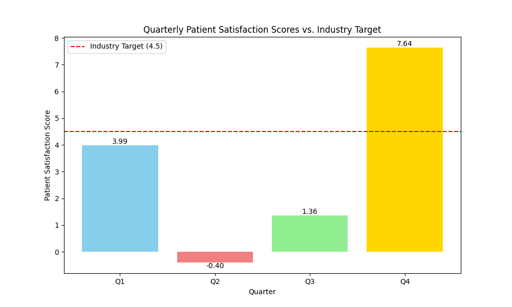

# Healthcare Performance Analysis: A Data Story

## Executive Summary

This report provides a data-driven analysis of the declining patient satisfaction scores in 2024. Our current average patient satisfaction score is **3.15**, which is significantly below the industry benchmark of **4.5**. This data story outlines the key findings, business implications, and provides actionable recommendations to address this critical issue.

My email: 24f1001256@ds.study.iitm.ac.in

## Key Findings

The quarterly data reveals a volatile trend in patient satisfaction:

- **Q1:** 3.99
- **Q2:** -0.4
- **Q3:** 1.36
- **Q4:** 7.64

The overall average for the year is **3.15**, which is a clear indicator that we are not meeting patient expectations consistently. The extremely low score in Q2 is a major cause for concern and requires immediate investigation. While Q4 shows a significant improvement, the inconsistency across the year points to systemic issues.

## Data Visualization

The following chart illustrates the quarterly patient satisfaction scores compared to the industry target.

## Business Implications

The current trend of low patient satisfaction has several negative business implications:

- **Damaged Reputation:** Consistently low scores can harm our reputation and brand image, making it difficult to attract new patients.
- **Reduced Patient Loyalty:** Dissatisfied patients are less likely to return for future healthcare needs, leading to a decline in patient retention.
- **Financial Impact:** Low satisfaction scores can impact insurance reimbursements and may lead to a decrease in overall revenue.
- **Staff Morale:** A negative patient environment can lead to decreased staff morale and higher turnover rates.

## Recommendations to Reach the Target of 4.5

To improve patient satisfaction and reach our target of 4.5, we recommend focusing on the following areas:

### 1. Improve Service Quality

- **Staff Training:** Implement comprehensive customer service training for all patient-facing staff. This should focus on empathy, communication, and problem-solving skills.
- **Personalized Patient Care:** Develop protocols for more personalized patient interactions. This could include follow-up calls after appointments and personalized care plans.
- **Feedback Mechanism:** Implement a real-time feedback system to capture patient concerns and suggestions at various touchpoints.

### 2. Reduce Wait Times

- **Process Optimization:** Conduct a thorough review of our appointment scheduling and patient check-in/check-out processes to identify and eliminate bottlenecks.
- **Technology Adoption:** Leverage technology, such as online check-in and automated reminders, to streamline processes and reduce manual effort.
- **Staffing Adjustments:** Analyze peak hours and adjust staffing levels accordingly to ensure that we have adequate coverage during busy periods.

By implementing these recommendations, we can create a more positive and efficient patient experience, which will lead to improved satisfaction scores and long-term success for our organization.
